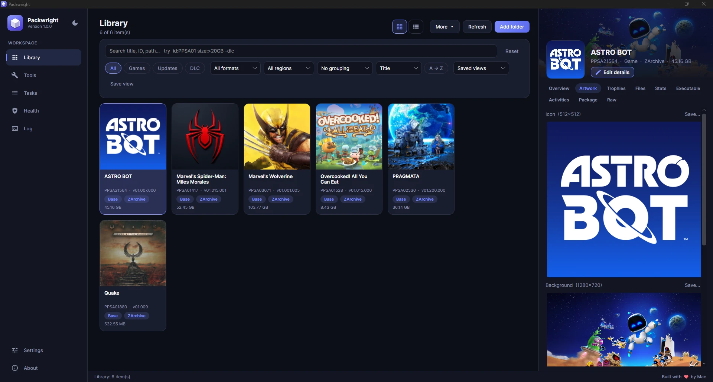

# Packwright

One app to manage your PS5 dump and image collection, read PS5 packages, fix their details, and build, convert and send them. For **Windows, Linux and macOS**.



> Packwright grew out of [PS5 PKG Tool](https://github.com/pearlxcore/PS5PkgTool) by [pearlxcore](https://github.com/pearlxcore)
> (GPL-3.0), and its image and package engines still power parts of this app. Thank you to pearlxcore.
> Details are in [License and credits](#license-and-credits).

**This is not software for obtaining free PS5 games.**

*PlayStation and PS5 are trademarks of Sony Interactive Entertainment Inc. This project is independent and is not affiliated with, authorized or endorsed by Sony. No Sony software or SDK files are included.*

> **Experimental:** Images and packages generated by this app have been validated and compared on PC, but they have not been tested on a jailbroken PS5. A successful build or validation does not guarantee that an image will mount, or that a package will install, launch, or play correctly on real hardware. The same goes for **Send to console**, which has only been tested against a simulated console. Keep backups and use generated output at your own risk.

## Contents

- [Highlights](#highlights)
- [Download and install](#download-and-install)
- [macOS help](#macos-help)
- [Getting started](#getting-started)
- [Features](#features)
- [Command line](#command-line)
- [Searching your library](#searching-your-library)
- [Where your data lives](#where-your-data-lives)
- [Platform support](#platform-support)
- [Build from source](#build-from-source)
- [Releases](#releases)
- [Project layout](#project-layout)
- [License and credits](#license-and-credits)

## Highlights

- **Library** of dumps, packages and images as artwork cards or a sortable list, with a search language, grouping, saved views and a details panel.
- **Fix missing details:** autofill what it can from the files, look titles up by Title ID, and edit names, IDs, firmware and icons, in the library or inside the file.
- **Image tools:** convert between exFAT, FFPKG, FFPFSC and ZArchive, build debug packages (FPKG), extract, verify, repair and edit files inside images, with presets.
- **Library health** report: moved or unreadable files, duplicates, superseded updates, wasted space and more.
- **Send to console** over FTP, or ask a console's installer to download a package from your PC.
- **Export** the library as CSV, JSON or a web page with artwork.
- **Command line** for scripts and servers.
- **Real installers** for every system, with a built-in update check that you control.

## Download and install

Download the installer for your system from the [latest release](https://github.com/itsmemac/Packwright/releases/latest). Everything is self-contained, so no .NET install is needed.

| System | Download | Install |
| --- | --- | --- |
| Windows 10/11 (64-bit) | `Packwright-Setup-v<version>-windows-x64.exe` | run it (no administrator rights needed) |
| macOS, Apple silicon | `Packwright-v<version>-macos-arm64.dmg` | open it, drag **Packwright** onto **Applications** |
| macOS, Intel | `Packwright-v<version>-macos-x64.dmg` | open it, drag **Packwright** onto **Applications** |
| Linux (64-bit), Debian, Ubuntu, Mint | `Packwright-v<version>-linux-x64.deb` | your software installer, or `sudo apt install ./<file>.deb` |
| Linux (64-bit), Fedora, openSUSE, RHEL | `Packwright-v<version>-linux-x64.rpm` | your software installer, or `sudo dnf install ./<file>.rpm` |

- **Uninstall:** Windows, Settings > Apps (or the Start menu entry); macOS, delete Packwright from Applications; Linux, `sudo apt remove packwright` or `sudo dnf remove packwright`.
- **Windows:** the installer is not code-signed, so Windows may say the publisher is unknown.
- **macOS:** the app is not notarized by Apple, so macOS asks for your approval the first time you open it. See [macOS help](#macos-help) for the steps.
- **Linux:** the package adds a menu entry and a `packwright` command (see [Command line](#command-line)).
- Each release also has `SHA256SUMS.txt` so you can verify a download.

Packwright only writes to your user profile (settings, library cache and thumbnails), never to the install folder.

## macOS help

Packwright needs **macOS 13 (Ventura) or later**. The macOS builds are less tested than the Windows one, so please report anything odd.

**1. Pick the right download**

Open the Apple menu, choose **About This Mac** and look at the line **Chip** or **Processor**:

- **Apple M1, M2, M3, M4...** (Apple silicon): `Packwright-v<version>-macos-arm64.dmg`
- **Intel**: `Packwright-v<version>-macos-x64.dmg`

**2. Install**

1. Double-click the downloaded `.dmg`.
2. Drag **Packwright** onto the **Applications** shortcut in the window that opens.
3. Eject the disk image (the eject button next to it in Finder's sidebar), then you can delete the `.dmg`.

**3. Open it the first time**

Packwright is not notarized by Apple (that needs a paid Apple developer account), so macOS shows a warning such as "Apple could not verify Packwright is free of malware" the first time. This is expected, and you only have to do it once. Following Apple's own steps ([Safely open apps on your Mac](https://support.apple.com/en-us/102445)):

1. Open **Packwright** from Applications. When the warning appears, click **Done** (or **OK**).
2. Open the Apple menu, then **System Settings**, then **Privacy & Security**.
3. Scroll down to the **Security** section. You will see a note that "Packwright" was blocked. Click **Open Anyway** and enter your password or use Touch ID.
4. Click **Open** in the next prompt.

From then on, Packwright opens with a normal double-click.

On macOS 14 (Sonoma) and earlier you can instead **Control-click** (or right-click) Packwright in Applications, choose **Open**, then click **Open** again.

Only do this for downloads you got from this project's [releases page](https://github.com/itsmemac/Packwright/releases). You can check a download against `SHA256SUMS.txt` in Terminal with `shasum -a 256 <file>.dmg`.

**If it still will not open**

- *"Packwright is damaged and can't be opened"* is macOS's wording for a blocked download. Run this once in Terminal, then open the app again:

  ```
  xattr -cr /Applications/Packwright.app
  ```

- The window does not appear: open **Terminal** and run `/Applications/Packwright.app/Contents/MacOS/Packwright version`. If it prints a version, the app is fine and the problem is only the permission step above. If you report a bug, include the log (**Log** page, then **Open log folder**).
- Files and folders: the first time Packwright reads a folder on an external drive, Downloads or Desktop, macOS asks whether to allow it. Choose **Allow**, or add Packwright under **System Settings, Privacy & Security, Files and Folders** (or **Full Disk Access**).

**Updating and removing**

- **Update:** Packwright can check for new versions (**About**, then **Check for updates**). It downloads and verifies the new `.dmg`; open it and drag Packwright onto **Applications** again, choosing **Replace**.
- **Uninstall:** quit Packwright and drag it from Applications to the Bin. Its settings and library cache live in `~/.local/share/Packwright`; delete that folder too if you want a clean removal.
- **Command line:** `/Applications/Packwright.app/Contents/MacOS/Packwright help` (see [Command line](#command-line)).

## Getting started

1. Open **Library** and choose **Add folder**. Point it at a folder with PS5 dumps, `.pkg` files or images. Use **More > Add a package or image file** for a single item.
2. Browse your collection as artwork cards or as a list. Select a game to see its details on the right.
3. Right-click a game for the things you can do with it: convert or build, extract or verify it, edit its details, send it to a console, rename, move or delete it.
4. Open **Tools** to convert, extract, verify or repair something. The source can come from the library, the file pickers, drag and drop onto the window, or the command line:

   ```
   Packwright "D:\Games\MyGame"
   Packwright --open "D:\Games\MyGame.pkg"
   ```

5. Every job is queued on the **Tasks** page, where you can follow progress, cancel, retry or clear it. Queued work survives a restart.

Packwright runs as one window: starting it again brings the open window to the front. It remembers the window's size, position and whether it was maximized.

## Features

### Library

- Scans folders for unpacked dumps, Sony `.pkg` files, `.ffpfsc`, `.ffpkg` and `.exfat` images, and ZArchive (`.zar`) files.
- **Cards** with game artwork, or a **list**. In the list, click a column name to sort (click again to reverse) and right-click a column header to choose which columns are shown.
- Group by family (base game, updates and DLC together), Title ID, category, region, format or firmware. Updates that a newer patch replaces are marked.
- A [search language](#searching-your-library) and **saved views** that remember the search, filters, grouping, sort and columns.
- Rename with a preview (presets or your own format), rename packages by install order, move, delete, find duplicates, and list updates or DLC that are missing a base game.
- **Export** what is shown (**More > Export what is shown**) as a CSV spreadsheet, a JSON file, or a single web page with artwork, summary figures, search and sortable columns that loads nothing from the internet. For JSON and the web page you choose whether file paths are included.
- The layout adapts to the window: the details panel becomes a slide-over and the sidebar shrinks to icons when the window is narrow.

### Game details

- Overview, artwork (with save), trophies (with icon export), activities, executable, package data, statistics and raw `param.json`.
- A file explorer for dumps, images and packages: a folder tree with icons, sizes and file counts, filtering, extraction of single files, whole folders or everything, and a preview for images (including DDS), text and raw bytes. It can also open in its own window with the preview beside the tree.

### Fix and complete details

- **Edit details and icon** of any title (right click it, or use **Edit details** in the details panel). Every detail the Overview shows can be changed: title, Title ID, Content ID, region, Concept ID, category, version, master version, required firmware, SDK version, DRM, default language, created date, tool version and the declared features (HDR, VRR, 120 Hz, PS VR2, PS5 Pro and so on), plus the icon. The region is the first two letters of the Content ID, so choosing one rewrites it. Format, size and path describe the file itself and cannot be edited. Keep the change in the library only, or write it into the file itself or a new copy: dump folders, exFAT, FFPKG, FFPFSC, ZArchive and debug packages are supported. If a dump or archive has no `param.json`, one is created. Packages are rebuilt as debug packages (retail or encrypted ones cannot be), and the builder sets their required firmware from the game's SDK.
- **Autofill missing details:** titles that lack a `param.json` are marked "Missing details" (search them with `missing:yes`). **Autofill missing** in Edit details, or **More > Fix missing details** for the whole library, works out what it can from the title itself (`nptitle.dat`, trophy data, the executable header, artwork) and from its file and folder names, shows you what it found and where it came from, and saves it only when you confirm. It never uses the network. Dumps that were stripped of their metadata may have little to go on.
- **Search PlayStation Network:** in Edit details, one button looks up the title's Title ID (read from the file or its name) in a public PS5 title list (andshrew's list, a 2 MB file downloaded once from GitHub and kept on your computer) and shows the matching entries to pick from. Picking one fills the title, Title ID, content ID and, from the PlayStation Store, the icon. You can also search by game name. **More > Look up missing details online** does this for the whole library for every title that has a Title ID. The only things sent are that one file download and, for icons, the game's name to store.playstation.com, about one request per second and only when you ask. The store search is not an official API and can change.

### Library health

The **Health** page checks the whole library at a glance: files that were moved or deleted, files that cannot be read, missing details, file names that disagree with their Title IDs, updates without their base game, exact duplicates, older copies and superseded updates (with the space they take), and drives that are nearly full. **Check files too** also looks inside every title for a missing icon and checks unpacked dumps for launch problems. Each issue has buttons to show the title in the Library, fix its details, or open its folder, and the report can be exported as Markdown. Nothing is deleted for you.

### Image tools

- **Convert** between dump folders and **exFAT**, **FFPKG**, **FFPFSC** and **ZArchive (`.zar`)** images, or build a debug package (**FPKG**) from a dump or an image. A `.zar` can be used as a source too: extract it, verify it, convert it to another image, or build a package from it.
- **Presets:** save the target and all its options under a name and apply them again in one click. A few presets are built in (for example the smallest FFPFSC, or a reproducible package). A preset never contains the source or output path.
- **Extract** a dump tree out of an image or package, and **verify** images and packages. A finished check says "Verified: no problems found" with what was checked and how long it took; a failed one says in plain words what is wrong.
- **Edit files** inside exFAT and FFPKG images (replace, add, import a folder, create folders, delete). Changes are rebuilt beside the original and swapped in only after verification.
- **Repair** a damaged exFAT image, **refresh the AMPR index**, and **rebuild** FFPKG metadata.
- ZArchive files are written and read by a managed implementation of the [ZArchive](https://github.com/Exzap/ZArchive) format (zstd blocks, SHA-256 integrity). A new archive is verified after the build, and a `.zar` in your library is browsed in place, without unpacking it.

### Debug packages (FPKG)

- Reads, verifies and extracts debug PS5 packages, including inner PFS browsing, trophies and PlayGo data.
- Builds a package from a dump or directly from an image. The Content ID is read from the source, and the passcode is configurable.
- Build options include inner compression (Auto, Kraken, uncompressed), Kraken level and threads, PlayGo chunks, DRM type, SDK version, a workspace folder, reproducible output, fake-signing and right.sprx injection. Free disk space is checked before a build starts.
- Retail packages are recognized but cannot be decoded without matching key material. Only debug packages built with the default or a known passcode are fully readable.

### Send to console

Right-click a game, image or package and choose **Send to console...** to put it on a console on your own network.

- **FTP upload:** large files are streamed, a partly sent file is continued (when the console supports it), a copy that is already there is skipped, and the size is checked afterwards. If the connection drops (a sleeping phone, a Wi-Fi hiccup) Packwright waits and reconnects by itself, up to six times in a row without progress, and shows a countdown. If it finally gives up, the task says why in plain words and **Retry** on the Tasks page picks up where it stopped. Dump folders upload file by file. It runs as a background task with progress on the Tasks page.
- **Install by URL** (for a `.pkg`): Packwright shares the file from your PC for the length of the download and asks the console's package installer to fetch it. Installer payloads differ in the request they expect, so the request is a template you can adjust; its defaults follow the common "remote package installer" style and are **untested** on a real console.
- **Consoles** are set up in **Settings > Manage consoles** (address, FTP port, default folder, **Test connection**). Console FTP payloads usually let anyone in, so the user name and password can stay empty. A phone or PC running an FTP app normally shows a user name and password to enter there; the password is saved in your settings file, not encrypted, and is never exported.
- **Privacy and safety:** only addresses on your local network are accepted, and nothing is contacted until you press Send or Test. Your firewall may ask you to allow Packwright while it shares a file.
- Also available as `packwright send` (see [Command line](#command-line)).

### Updates

Packwright can check GitHub for a newer version. It asks once, **About > Check for updates** works any time, and automatic checks run at most once a day and can be turned off in **Settings**. When a new version is out you see what is new and the download is checked against the release's `SHA256SUMS.txt`. On Windows, one button then installs it and restarts Packwright; on Linux and macOS it downloads the right package and tells you how to install it. Nothing is installed without you pressing a button, and the only server contacted is github.com.

### Settings and everyday comfort

- Light or dark theme (the moon button at the top of the sidebar), library layout, artwork on or off, output and rename defaults, preview limits, default passcode and builder, confirmation prompts.
- Import and export settings (the passcode is left out unless you ask for it).
- On Windows, an optional "Open with Packwright" entry for Explorer's right-click menu (per user, no administrator rights).

## Command line

Everything heavy can also run without the window, for scripts and servers. On Windows use `packwright.cmd` (installed beside `Packwright.exe`) so the prompt waits for the result; on Linux the package adds a `packwright` command, and on macOS run `/Applications/Packwright.app/Contents/MacOS/Packwright`.

```
packwright info "D:\Games\PS5\Quake\PPSA01880-app0.zar"
packwright scan D:\Games\PS5 --csv -o library.csv      # or --json
packwright health D:\Games\PS5 --md                     # exit code 1 when a real problem is found
packwright verify game.ffpkg
packwright extract game.pkg -o out-folder --passcode 00000000000000000000000000000000
packwright convert dump-folder --to ffpfsc --level 9
packwright convert game.zar --to exfat --preset "exFAT image with AMPR index"
packwright send big.pkg --to "My PS5" --folder /data/games     # FTP; add --install to let the console download a .pkg
packwright consoles                                       # the consoles saved in Settings
packwright help
```

`convert` takes the same options as the Tools page (and its presets, saved or built in). Exit codes: 0 done, 1 failed, 2 wrong usage, 130 cancelled. Apart from `send`, which talks to a console on your local network, the command line only uses local files and never connects to the internet.

## Searching your library

Type in the search box. Words are combined with AND, `|` means OR, and a leading `-` excludes.

| Term | Matches |
| --- | --- |
| `bloodborne` | any field containing the text |
| `"spider man"` | an exact phrase |
| `title:` `id:` `content:` | name, Title ID, Content ID |
| `category:` `role:` `region:` `format:` | category (Game, Patch, DLC), role, region, format |
| `version:` `fw:` `path:` `feature:` | version, required firmware, path, declared feature |
| `missing:yes` | titles with missing details |
| `size:>50GB` `version:>=01.05` | comparisons (`>` `>=` `<` `<=`) on size and version |
| `id:=PPSA12345` | `=` after the colon requires an exact match |
| `-dlc` | hide anything matching |

Example: `id:PPSA01 size:>20GB -dlc | category:patch`.

## Where your data lives

| What | Location |
| --- | --- |
| Settings (including consoles and presets), library cache, task history | Windows `%LOCALAPPDATA%\Packwright`, Linux and macOS `~/.local/share/Packwright` |
| Library-only edits (`metadata-overrides.json`, `overrides/` for custom icons) | the same folder |
| Logs | `logs/` inside that folder (also shown on the **Log** page) |
| Temporary work files | your system temporary folder, or the workspace folder you choose |

Delete the folder to reset the app. Setting the `PACKWRIGHT_DATA` environment variable to a folder makes a separate copy of the app use that folder instead (handy for testing).

## Platform support

| Feature | Windows | Linux | macOS |
| --- | :---: | :---: | :---: |
| Library, details, file preview | yes | yes | yes |
| exFAT, FFPKG, FFPFSC, ZArchive convert, extract, verify, edit | yes | yes | yes |
| FPKG build with ProsperoPkgTool | yes | yes | yes |
| FPKG build with LibProsperoPkg | yes | - | - |
| Kraken-compressed package content | yes | yes | yes |
| Send to console, health report, export, command line | yes | yes | yes |
| One-button update install | yes | - | - |
| Explorer context menu | yes | - | - |

The filesystem, image, ZArchive and package code (including Kraken compression, which ProsperoPkgTool implements itself) is managed C# and behaves the same everywhere. LibProsperoPkg is a Windows-only library, so the other systems use ProsperoPkgTool for package builds. Linux and macOS builds are produced by the release workflow, but the Windows build has had the most testing.

## Build from source

Requirements: the [.NET 10 SDK](https://dotnet.microsoft.com/download). No other tools or sibling repositories are needed.

```
git clone https://github.com/itsmemac/Packwright.git
cd Packwright

dotnet build Packwright.slnx -c Release
dotnet run --project src/Packwright.App
```

Publish a self-contained build for one system (run from the repository root):

```
dotnet publish src/Packwright.App -c Release -r win-x64   --self-contained true -o publish/win-x64
dotnet publish src/Packwright.App -c Release -r linux-x64 --self-contained true -o publish/linux-x64
dotnet publish src/Packwright.App -c Release -r osx-arm64 --self-contained true -o publish/osx-arm64
dotnet publish src/Packwright.App -c Release -r osx-x64   --self-contained true -o publish/osx-x64
```

The Windows publish also copies the Windows-only libraries from `third-party/`. Any system can publish for any target.

The installers are built from a publish folder: `installer/Packwright.iss` (Inno Setup 6, Windows), `installer/linux/build-packages.sh` (`.deb` and `.rpm`, needs `dpkg-deb` and `rpmbuild`), and the macOS disk image step in `.github/workflows/release.yml`.

## Releases

Releases are automatic. Every push to `main` builds the app for Windows, Linux and macOS and publishes a GitHub release named after the `<Version>` in `src/Packwright.App/Packwright.App.csproj`. Every download is an installer (a Windows setup program, macOS disk images, and Linux `.deb` and `.rpm` packages), attached with `SHA256SUMS.txt`. There are no zip or tar archives.

- To publish a new version, raise `<Version>` and push to `main`.
- Pushing again without changing the version refreshes that version's release with the new build.
- Changes that only touch Markdown files or `LICENSE` do not trigger a release.
- Pull requests are built on all four targets (without publishing) to catch breakage early.

The workflows live in `.github/workflows/`: `release.yml` and `build.yml`.

## Project layout

```
src/
  Packwright.App         Avalonia application: pages, styles, queue glue, command line
  Packwright.Core        Packages, parsers, library scanner, builders, FTP client, update checker, task queue
  Packwright.Containers  exFAT, PFS/PFSC (FFPFSC) and ZArchive images
  Packwright.Ufs2        UFS2 / FFPKG filesystem
installer/                 Windows installer script and Linux package builder
third-party/               Vendored binaries (ProsperoPkgTool, LibProsperoPkg) and license texts
docs/                      Screenshots
.github/workflows/         Build and release automation
Packwright.slnx            Solution
```

## License and credits

Copyright (c) 2026 itsmemac. Packwright is licensed under the [GNU General Public License v3.0](LICENSE), with no warranty.

It started from [PS5 PKG Tool](https://github.com/pearlxcore/PS5PkgTool) by pearlxcore (Copyright (c) pearlxcore, GPL-3.0) and has since grown into a different application, with a new cross-platform interface and many new features. Parts of its image and package engines are still used, so its copyright and license notices are kept. The changes made in 2026 are listed in [THIRD_PARTY_NOTICES.md](THIRD_PARTY_NOTICES.md), which also lists every bundled component, its license and its copyright. The source of each release is the tag with the same version in this repository, and the license texts of the bundled components ship in the `licenses` folder of the installed app.

- **[pearlxcore](https://github.com/pearlxcore/PS5PkgTool)**: author of PS5 PKG Tool, the project Packwright grew out of, and of the ProsperoPkgTool engine.
- **[SvenGDK](https://github.com/SvenGDK/LibProsperoPKG)**: LibProsperoPkg, and the UFS2Tool filesystem code the FFPKG support is based on.
- **[PSBrew / Renan Barreto](https://github.com/PSBrew/MkPFS)**: MkPFS.
- **[kerrdec97](https://github.com/kerrdec97/ps5-exfat-builder)**: ps5-exfat-builder.
- **[strongt1me](https://github.com/strongt1me/PS5-Dump-Image-Converter)**: PS5-Dump-Image-Converter.
- **[Exzap](https://github.com/Exzap/ZArchive)**: the ZArchive format.
- **[andshrew](https://github.com/andshrew/PlayStation-Titles)**: the PS5 title list that Title ID lookups use (MIT License).
- **[Avalonia UI](https://avaloniaui.net)**, **[ZstdSharp](https://github.com/oleg-st/ZstdSharp)**, **[CommunityToolkit](https://github.com/CommunityToolkit/dotnet)** (HighPerformance, used by LibProsperoPkg), **[ImageSharp](https://github.com/SixLabors/ImageSharp)** and **[BCnEncoder.Net](https://github.com/Nominom/BCnEncoder.NET)**.
- Robin Perris for [DarkUI](https://github.com/RobinPerris/DarkUI), which the original Windows interface was built on.
- Sony <3
